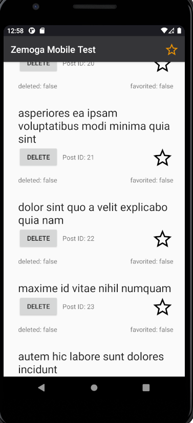
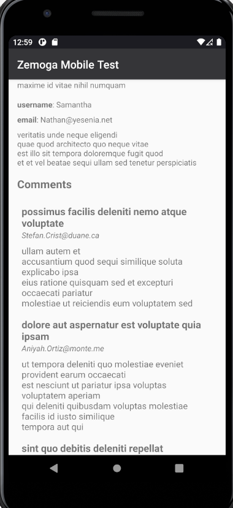

# Zemoga Code Challenge

  
  

## General Description

**Architecture**: I used the MVVM (Model-View-ViewModel) architecture. I used interactors as an example to include some business logic rules.

**Repository**: In the Model layer, I abstracted a repository that provides the necessary data to the ViewModel without the other parts knowing how this data was obtained. The `NetworkBoundResource` class is responsible for the algorithm to obtain the data (allows obtaining data from remote and/or local storage).

**Tests**: I included several unit tests and some instrumented tests to demonstrate knowledge in the use of main libraries (JUnit, Mockk, Roboelectric). I did not implement UI tests.

**Dependency Injection**: I did not use it in the project, but I have knowledge in Koin and Dagger 2.

## Technical Description

I used the following libraries and solutions:

- **Retrofit**: Used to fetch data remotely.

- **Mockk**: Library used to create mocks of classes to facilitate class isolation in unit tests.

- **Coroutines**: Used for asynchronous tasks during app execution.

- **Android Architecture Components**: Used for implementing the MVVM architecture. Used LiveData, ViewModel, among others.

- **Room**: Used for data model storage.

## What was not implemented

**Mechanism to load all posts from API**: This mechanism occurs, but we do not have control over when to force that. The implemented mechanism fetches from API if there is no local data, for the sake of simplicity.

**UI Tests**: UI tests are harder to keep in projects as they take too long to be executed and are prone to flaky errors. So for time-saving purposes, I didn't add any UI tests.

## How to run

The app can be built like any other app. No additional instructions about that.
The same applies to tests.
